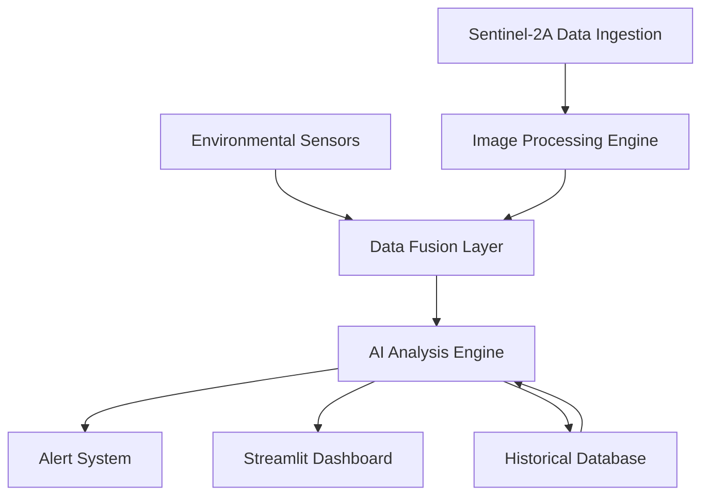

# Design Document

## Overview

The Agricultural Monitoring Platform is designed as a modular system that processes Sentinel-2A multispectral satellite imagery to extract vegetation and soil health indicators. The platform leverages the rich spectral information available in Sentinel-2A data, particularly focusing on vegetation indices like NDVI, SAVI, EVI, and soil moisture indicators. The system integrates with environmental sensor networks to provide comprehensive field monitoring capabilities.

## Architecture

### System Components



### Technology Stack

- **Image Processing**: Python with rasterio, GDAL, and scikit-image for Sentinel-2A JP2 file handling
- **Machine Learning**: TensorFlow/Keras for CNN and LSTM models
- **Geospatial Processing**: GeoPandas, Shapely for coordinate transformations and spatial analysis
- **Web Framework**: Streamlit for interactive dashboard and data visualization
- **Database**: PostgreSQL with PostGIS extension for spatial data storage
- **Time Series**: InfluxDB for sensor data and temporal vegetation indices
- **Visualization**: Folium for interactive maps in Streamlit, Plotly for charts and graphs

## Components and Interfaces

### 1. Sentinel-2A Data Processor

**Purpose**: Ingest and preprocess Sentinel-2A SAFE format data

**Key Functions**:
- Parse SAFE directory structure and extract JP2 band files
- Read metadata from MTD_MSIL2A.xml for geospatial information
- Resample bands to common 10m resolution grid
- Apply atmospheric correction using Level-2A products
- Generate cloud masks using Scene Classification Layer (SCL)

**Input**: Sentinel-2A SAFE directories (like the S2A_MSIL2A_20240923T053641_N0511_R005_T43REQ_20240923T084448.SAFE in workspace)

**Output**: Preprocessed raster arrays for each spectral band

### 2. Vegetation Index Calculator

**Purpose**: Compute standardized vegetation and soil indices

**Key Indices**:

- **NDVI (Normalized Difference Vegetation Index)**:
  ```
  NDVI = (NIR - Red) / (NIR + Red) = (B08 - B04) / (B08 + B04)
  ```
  Range: -1 to +1, where higher values indicate healthier vegetation

- **SAVI (Soil Adjusted Vegetation Index)**:
  ```
  SAVI = ((NIR - Red) / (NIR + Red + L)) * (1 + L)
  ```
  Where L = 0.5 for moderate vegetation density

- **EVI (Enhanced Vegetation Index)**:
  ```
  EVI = 2.5 * ((NIR - Red) / (NIR + 6*Red - 7.5*Blue + 1))
  ```
  Using B08 (NIR), B04 (Red), B02 (Blue)

- **NDWI (Normalized Difference Water Index)**:
  ```
  NDWI = (Green - NIR) / (Green + NIR) = (B03 - B08) / (B03 + B08)
  ```

- **NDSI (Normalized Difference Soil Index)**:
  ```
  NDSI = (SWIR1 - SWIR2) / (SWIR1 + SWIR2) = (B11 - B12) / (B11 + B12)
  ```

**Input**: Calibrated spectral bands from Sentinel-2A
**Output**: Georeferenced index rasters with pixel-level values

### 3. Environmental Data Integration

**Purpose**: Integrate sensor data with spectral analysis

**Sensor Types**:
- Soil moisture sensors (volumetric water content)
- Weather stations (temperature, humidity, precipitation)
- Leaf wetness sensors
- Solar radiation sensors

**Data Fusion Approach**:
- Spatial interpolation of point sensor data to match satellite pixel grid
- Temporal alignment of sensor readings with satellite overpass times
- Quality flagging for missing or anomalous sensor data

### 4. AI Analysis Engine

**CNN Model for Spatial Analysis**:
- Input: Multi-band spectral data (B02, B03, B04, B08, B11, B12) + derived indices
- Architecture: U-Net style encoder-decoder for pixel-level classification
- Output: Crop health classification (healthy, stressed, diseased, pest damage)

**LSTM Model for Temporal Analysis**:
- Input: Time series of vegetation indices and environmental data
- Architecture: Bidirectional LSTM with attention mechanism
- Output: Trend predictions and anomaly detection scores

**Risk Prediction Models**:
- Pest outbreak probability based on environmental conditions
- Disease risk assessment using spectral signatures
- Yield prediction using historical patterns

## Data Models

### Satellite Image Record
```python
class SatelliteImage:
    id: str
    acquisition_date: datetime
    tile_id: str  # e.g., "T43REQ"
    cloud_coverage: float
    bands: Dict[str, np.ndarray]  # B02, B03, B04, B08, B11, B12
    indices: Dict[str, np.ndarray]  # NDVI, SAVI, EVI, etc.
    geometry: Polygon  # Spatial extent
    quality_flags: Dict[str, bool]
```

### Field Monitoring Zone
```python
class MonitoringZone:
    id: str
    name: str
    geometry: Polygon
    crop_type: str
    planting_date: datetime
    expected_harvest: datetime
    sensors: List[SensorLocation]
    alerts: List[Alert]
```

### Vegetation Index Time Series
```python
class IndexTimeSeries:
    zone_id: str
    index_type: str  # "NDVI", "SAVI", etc.
    timestamp: datetime
    mean_value: float
    std_deviation: float
    pixel_count: int
    quality_score: float
```

## Error Handling

### Data Quality Issues
- **Cloud Contamination**: Use SCL layer to mask cloudy pixels, interpolate missing data
- **Atmospheric Interference**: Validate Level-2A atmospheric correction, flag suspicious values
- **Sensor Malfunctions**: Implement data validation rules, use neighboring sensor interpolation

### Processing Failures
- **Memory Limitations**: Implement tile-based processing for large rasters
- **Model Inference Errors**: Graceful degradation to simpler analysis methods
- **Network Connectivity**: Cache critical data locally, queue updates for later sync

### Alert System Reliability
- **False Positives**: Implement confidence thresholds and multi-factor validation
- **Communication Failures**: Multiple notification channels (SMS, email, push notifications)
- **Critical Alert Escalation**: Automatic escalation if acknowledgment not received

## Testing Strategy

### Unit Testing
- Vegetation index calculations with known input/output pairs
- Sentinel-2A file parsing with sample SAFE directories
- Sensor data validation and quality flagging
- Geospatial coordinate transformations

### Integration Testing
- End-to-end processing pipeline with real Sentinel-2A data
- AI model inference with historical datasets
- Alert generation and notification delivery
- Dashboard data visualization accuracy

### Performance Testing
- Large raster processing benchmarks
- Concurrent user load testing
- Real-time sensor data ingestion rates
- Model inference latency measurements

### Field Validation
- Ground truth comparison with manual field surveys
- Correlation analysis between indices and actual crop conditions
- Pest outbreak prediction accuracy assessment
- User acceptance testing with agricultural professionals