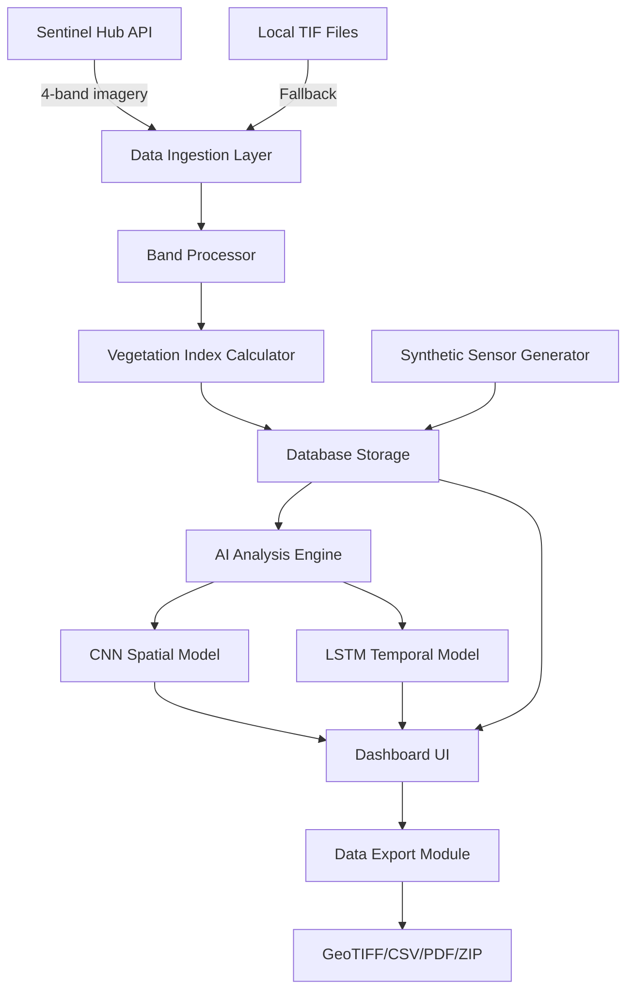

# Design Document

## Overview

The Production Enhancements design transforms AgriFlux from a functional prototype into a production-ready agricultural monitoring platform with real satellite data integration, genuine AI/ML capabilities, and professional UI/UX. The system integrates with Sentinel Hub API to fetch real Sentinel-2A imagery for the Ludhiana agricultural region, calculates actual vegetation indices using scientifically accurate formulas, implements trained CNN and LSTM models for intelligent crop health analysis, generates realistic synthetic sensor data for demonstration purposes, provides reliable data export functionality, enhances temporal analysis with anomaly detection and trend forecasting, and applies modern UI/UX design principles with custom styling and responsive layouts.

## Architecture

### System Architecture Diagram



### Technology Stack

**Core Technologies:**
- Python 3.9+
- Streamlit 1.28+ for dashboard
- TensorFlow 2.x for AI models
- Rasterio/GDAL for geospatial processing
- Requests for API integration
- NumPy/Pandas for data processing

**Key Libraries:**
- sentinelhub: Sentinel Hub API client
- rasterio: GeoTIFF reading/writing
- tensorflow/keras: Deep learning models
- scikit-learn: ML utilities
- plotly: Interactive visualizations
- folium: Interactive maps
- reportlab: PDF generation

## Components and Interfaces

### 1. Sentinel Hub API Integration

**Purpose**: Fetch real Sentinel-2A imagery for Ludhiana region using GeoJSON boundaries

**Key Functions**:
- `query_sentinel_imagery(geojson, date_range, cloud_threshold)`: Query API for imagery
- `download_multispectral_bands(image_id, bands)`: Download specific bands
- `filter_by_cloud_coverage(images, threshold)`: Filter images by cloud coverage
- `fallback_to_local_tif()`: Switch to local file processing on API failure

**API Configuration**:
```python
SENTINEL_HUB_CONFIG = {
    'instance_id': os.getenv('SENTINEL_HUB_INSTANCE_ID'),
    'client_id': os.getenv('SENTINEL_HUB_CLIENT_ID'),
    'client_secret': os.getenv('SENTINEL_HUB_CLIENT_SECRET'),
    'base_url': 'https://services.sentinel-hub.com',
    'bands': ['B02', 'B03', 'B04', 'B08'],  # Blue, Green, Red, NIR
    'resolution': 10,  # meters
    'max_cloud_coverage': 20  # percent
}
```

**Ludhiana GeoJSON Example**:
```json
{
  "type": "Polygon",
  "coordinates": [[
    [75.80, 30.90],
    [75.90, 30.90],
    [75.90, 31.00],
    [75.80, 31.00],
    [75.80, 30.90]
  ]]
}
```


### 2. Real Vegetation Index Calculator

**Purpose**: Calculate scientifically accurate vegetation indices from multispectral bands

**Index Formulas**:

**NDVI (Normalized Difference Vegetation Index)**:
```python
def calculate_ndvi(nir, red):
    """
    NDVI = (NIR - Red) / (NIR + Red)
    Range: -1 to +1
    """
    denominator = nir + red
    ndvi = np.where(denominator != 0, (nir - red) / denominator, 0)
    return np.clip(ndvi, -1, 1)
```

**SAVI (Soil Adjusted Vegetation Index)**:
```python
def calculate_savi(nir, red, L=0.5):
    """
    SAVI = ((NIR - Red) / (NIR + Red + L)) * (1 + L)
    L = 0.5 for moderate vegetation
    Range: -1.5 to +1.5
    """
    denominator = nir + red + L
    savi = np.where(denominator != 0, ((nir - red) / denominator) * (1 + L), 0)
    return np.clip(savi, -1.5, 1.5)
```

**EVI (Enhanced Vegetation Index)**:
```python
def calculate_evi(nir, red, blue):
    """
    EVI = 2.5 * ((NIR - Red) / (NIR + 6*Red - 7.5*Blue + 1))
    Range: -1 to +1
    """
    denominator = nir + 6 * red - 7.5 * blue + 1
    evi = np.where(denominator != 0, 2.5 * ((nir - red) / denominator), 0)
    return np.clip(evi, -1, 1)
```

**NDWI (Normalized Difference Water Index)**:
```python
def calculate_ndwi(green, nir):
    """
    NDWI = (Green - NIR) / (Green + NIR)
    Range: -1 to +1
    """
    denominator = green + nir
    ndwi = np.where(denominator != 0, (green - nir) / denominator, 0)
    return np.clip(ndwi, -1, 1)
```

**Validation**:
```python
def validate_index(index_array, expected_range):
    """Validate index values are within expected range"""
    min_val, max_val = expected_range
    out_of_range = (index_array < min_val) | (index_array > max_val)
    if np.any(out_of_range):
        logger.warning(f"Found {np.sum(out_of_range)} out-of-range values")
        return False, out_of_range
    return True, None
```

### 3. AI/ML Model Implementation

**Purpose**: Implement genuine CNN and LSTM models for crop health prediction

**CNN Model Architecture**:
```python
class CropHealthCNN:
    def __init__(self):
        self.model = self._build_model()
    
    def _build_model(self):
        model = Sequential([
            Conv2D(32, (3, 3), activation='relu', input_shape=(64, 64, 4)),
            BatchNormalization(),
            MaxPooling2D((2, 2)),
            
            Conv2D(64, (3, 3), activation='relu'),
            BatchNormalization(),
            MaxPooling2D((2, 2)),
            
            Conv2D(128, (3, 3), activation='relu'),
            BatchNormalization(),
            MaxPooling2D((2, 2)),
            
            Flatten(),
            Dense(128, activation='relu'),
            Dropout(0.3),
            Dense(4, activation='softmax')  # 4 classes: healthy, stressed, diseased, pest
        ])
        
        model.compile(
            optimizer='adam',
            loss='categorical_crossentropy',
            metrics=['accuracy']
        )
        return model
    
    def predict_with_confidence(self, image_patch):
        """Return predictions with confidence scores"""
        probs = self.model.predict(image_patch)
        predictions = np.argmax(probs, axis=1)
        confidence = np.max(probs, axis=1)
        return predictions, confidence
```

**LSTM Model Architecture**:
```python
class VegetationTrendLSTM:
    def __init__(self, sequence_length=30):
        self.sequence_length = sequence_length
        self.model = self._build_model()
    
    def _build_model(self):
        model = Sequential([
            Bidirectional(LSTM(64, return_sequences=True), 
                         input_shape=(self.sequence_length, 4)),
            Dropout(0.2),
            Bidirectional(LSTM(32)),
            Dropout(0.2),
            Dense(16, activation='relu'),
            Dense(1)  # Predict next NDVI value
        ])
        
        model.compile(optimizer='adam', loss='mse', metrics=['mae'])
        return model
    
    def predict_trend(self, time_series):
        """Predict future values and detect anomalies"""
        predictions = self.model.predict(time_series)
        return predictions
```

**Rule-Based Fallback**:
```python
class RuleBasedClassifier:
    """Fallback when AI models unavailable"""
    
    THRESHOLDS = {
        'healthy': 0.7,
        'moderate': 0.5,
        'stressed': 0.3
    }
    
    def classify(self, ndvi_value):
        if ndvi_value >= self.THRESHOLDS['healthy']:
            return 'healthy', 0.9
        elif ndvi_value >= self.THRESHOLDS['moderate']:
            return 'moderate', 0.7
        elif ndvi_value >= self.THRESHOLDS['stressed']:
            return 'stressed', 0.6
        else:
            return 'critical', 0.8
```


### 4. Synthetic Sensor Data Generator

**Purpose**: Generate realistic synthetic sensor data correlated with satellite imagery

**Implementation**:
```python
class SyntheticSensorGenerator:
    """Generate realistic synthetic sensor data"""
    
    def generate_soil_moisture(self, ndvi_values, noise_level=0.1):
        """
        Generate soil moisture correlated with NDVI
        Higher NDVI -> Higher soil moisture
        """
        # Base correlation: NDVI 0.8 -> 30% moisture, NDVI 0.3 -> 10% moisture
        base_moisture = 10 + (ndvi_values - 0.3) * 40
        
        # Add realistic noise
        noise = np.random.normal(0, noise_level * base_moisture, size=base_moisture.shape)
        moisture = np.clip(base_moisture + noise, 0, 50)
        
        return moisture
    
    def generate_temperature(self, dates, location_lat, noise_level=2.0):
        """
        Generate temperature based on season and location
        """
        # Extract day of year for seasonal pattern
        day_of_year = np.array([d.timetuple().tm_yday for d in dates])
        
        # Seasonal pattern (sine wave)
        seasonal = 25 + 10 * np.sin(2 * np.pi * (day_of_year - 80) / 365)
        
        # Add daily variation
        daily_variation = np.random.normal(0, noise_level, size=len(dates))
        
        temperature = seasonal + daily_variation
        return np.clip(temperature, 5, 45)
    
    def generate_humidity(self, temperature, soil_moisture, noise_level=5.0):
        """
        Generate humidity correlated with temperature and soil moisture
        Higher temp -> Lower humidity (inverse)
        Higher soil moisture -> Higher humidity
        """
        # Base humidity inversely related to temperature
        base_humidity = 80 - (temperature - 20) * 1.5
        
        # Adjust for soil moisture
        moisture_effect = soil_moisture * 0.5
        
        # Add noise
        noise = np.random.normal(0, noise_level, size=len(temperature))
        
        humidity = base_humidity + moisture_effect + noise
        return np.clip(humidity, 20, 95)
    
    def generate_leaf_wetness(self, humidity, temperature, noise_level=0.05):
        """
        Generate leaf wetness based on humidity and temperature
        High humidity + moderate temp -> High leaf wetness
        """
        # Leaf wetness increases with humidity
        base_wetness = (humidity - 50) / 50  # 0-1 scale
        
        # Temperature effect (optimal around 20-25°C)
        temp_factor = 1 - abs(temperature - 22.5) / 22.5
        temp_factor = np.clip(temp_factor, 0, 1)
        
        wetness = base_wetness * temp_factor
        
        # Add noise
        noise = np.random.normal(0, noise_level, size=len(humidity))
        wetness = np.clip(wetness + noise, 0, 1)
        
        return wetness
    
    def add_temporal_variation(self, data, variation_factor=0.1):
        """Add realistic temporal variation to sensor data"""
        # Add autocorrelation (current value depends on previous)
        for i in range(1, len(data)):
            data[i] = 0.7 * data[i] + 0.3 * data[i-1]
        
        return data
```

### 5. Data Export Module

**Purpose**: Provide reliable export functionality for all data types

**GeoTIFF Export**:
```python
def export_geotiff(index_array, transform, crs, output_path):
    """
    Export vegetation index as GeoTIFF with proper georeferencing
    """
    with rasterio.open(
        output_path,
        'w',
        driver='GTiff',
        height=index_array.shape[0],
        width=index_array.shape[1],
        count=1,
        dtype=index_array.dtype,
        crs=crs,
        transform=transform,
        compress='lzw'
    ) as dst:
        dst.write(index_array, 1)
        dst.update_tags(
            index_name='NDVI',
            calculation_date=datetime.now().isoformat(),
            source='AgriFlux'
        )
    
    # Verify file integrity
    with rasterio.open(output_path) as src:
        assert src.crs == crs
        assert src.transform == transform
    
    return output_path
```

**CSV Export**:
```python
def export_time_series_csv(time_series_data, output_path):
    """
    Export time series data as CSV with metadata
    """
    df = pd.DataFrame(time_series_data)
    
    # Add metadata as header comments
    metadata = {
        'export_date': datetime.now().isoformat(),
        'source': 'AgriFlux',
        'location': 'Ludhiana, Punjab',
        'indices': ', '.join(df.columns)
    }
    
    with open(output_path, 'w') as f:
        # Write metadata
        for key, value in metadata.items():
            f.write(f'# {key}: {value}\n')
        
        # Write data
        df.to_csv(f, index=True)
    
    # Verify file
    df_verify = pd.read_csv(output_path, comment='#')
    assert len(df_verify) == len(df)
    
    return output_path
```

**PDF Report Generation**:
```python
def generate_pdf_report(data, output_path):
    """
    Generate PDF report with maps, charts, and statistics
    """
    from reportlab.lib.pagesizes import letter
    from reportlab.platypus import SimpleDocTemplate, Paragraph, Image, Table
    from reportlab.lib.styles import getSampleStyleSheet
    
    doc = SimpleDocTemplate(output_path, pagesize=letter)
    story = []
    styles = getSampleStyleSheet()
    
    # Title
    story.append(Paragraph("AgriFlux Crop Health Report", styles['Title']))
    
    # Summary statistics
    stats_data = [
        ['Metric', 'Value'],
        ['Average NDVI', f"{data['ndvi_mean']:.3f}"],
        ['Health Status', data['health_status']],
        ['Alert Count', str(data['alert_count'])]
    ]
    story.append(Table(stats_data))
    
    # Add charts (saved as temp images)
    if 'chart_path' in data:
        story.append(Image(data['chart_path'], width=400, height=300))
    
    doc.build(story)
    return output_path
```

**ZIP Archive**:
```python
def create_batch_export_zip(file_paths, output_path):
    """
    Package multiple files into organized ZIP archive
    """
    import zipfile
    
    with zipfile.ZipFile(output_path, 'w', zipfile.ZIP_DEFLATED) as zipf:
        for file_path in file_paths:
            # Organize by type
            if file_path.endswith('.tif'):
                arcname = f'geotiff/{os.path.basename(file_path)}'
            elif file_path.endswith('.csv'):
                arcname = f'csv/{os.path.basename(file_path)}'
            elif file_path.endswith('.pdf'):
                arcname = f'reports/{os.path.basename(file_path)}'
            else:
                arcname = os.path.basename(file_path)
            
            zipf.write(file_path, arcname)
    
    # Verify ZIP integrity
    with zipfile.ZipFile(output_path, 'r') as zipf:
        assert zipf.testzip() is None
    
    return output_path, os.path.getsize(output_path)
```


### 6. Enhanced Temporal Analysis with User-Friendly Explanations

**Purpose**: Provide advanced time series analysis with anomaly detection, trend forecasting, and plain-language explanations that guide user actions

**Trend Analysis with Contextual Explanations**:
```python
class TrendAnalyzer:
    """Analyze vegetation index trends over time with user-friendly explanations"""
    
    def fit_regression(self, time_series, index_name='NDVI'):
        """Fit linear regression to time series with plain-language interpretation"""
        from sklearn.linear_model import LinearRegression
        
        X = np.arange(len(time_series)).reshape(-1, 1)
        y = time_series.values
        
        model = LinearRegression()
        model.fit(X, y)
        
        # Calculate confidence intervals
        predictions = model.predict(X)
        residuals = y - predictions
        std_error = np.std(residuals)
        confidence_interval = 1.96 * std_error  # 95% CI
        
        # Calculate rate of change in user-friendly units
        slope = model.coef_[0]
        days_in_data = len(time_series)
        
        # Convert to percentage change per week
        weekly_change = (slope * 7 / y.mean()) * 100 if y.mean() != 0 else 0
        monthly_change = (slope * 30 / y.mean()) * 100 if y.mean() != 0 else 0
        
        # Generate plain-language explanation
        if abs(weekly_change) < 0.5:
            explanation = f"Your {index_name} is stable with minimal change over time."
            recommendation = "Continue current management practices."
        elif weekly_change > 0:
            explanation = f"Your crops are improving by {abs(weekly_change):.1f}% per week."
            recommendation = "Excellent progress! Maintain current irrigation and fertilization."
        else:
            explanation = f"Your crops are declining by {abs(weekly_change):.1f}% per week."
            recommendation = "⚠️ Consider increasing irrigation or investigating pest/disease issues."
        
        return {
            'slope': slope,
            'intercept': model.intercept_,
            'predictions': predictions,
            'confidence_lower': predictions - confidence_interval,
            'confidence_upper': predictions + confidence_interval,
            'weekly_change_pct': weekly_change,
            'monthly_change_pct': monthly_change,
            'explanation': explanation,
            'recommendation': recommendation,
            'r_squared': model.score(X, y)
        }
    
    def detect_anomalies(self, time_series, dates, threshold_std=2.0):
        """Detect anomalies with plain-language descriptions"""
        mean = time_series.mean()
        std = time_series.std()
        
        # Z-score method
        z_scores = np.abs((time_series - mean) / std)
        anomalies = z_scores > threshold_std
        
        # Generate descriptions for each anomaly
        anomaly_descriptions = []
        for i, is_anomaly in enumerate(anomalies):
            if is_anomaly:
                date = dates[i]
                value = time_series.iloc[i]
                deviation = z_scores[i]
                
                if value > mean:
                    direction = "spike"
                    action = "Verify data quality or investigate unusual growth conditions"
                else:
                    direction = "drop"
                    action = "Investigate irrigation, pest damage, or disease"
                
                description = f"Unusual {direction} detected on {date.strftime('%b %d, %Y')}: " \
                            f"{value:.3f} ({deviation:.1f}σ from normal). {action}."
                
                anomaly_descriptions.append({
                    'date': date,
                    'value': value,
                    'z_score': deviation,
                    'description': description
                })
        
        return {
            'anomalies': anomalies,
            'z_scores': z_scores,
            'descriptions': anomaly_descriptions,
            'count': sum(anomalies)
        }
    
    def decompose_seasonal(self, time_series, period=365):
        """Decompose time series with explanations for each component"""
        from statsmodels.tsa.seasonal import seasonal_decompose
        
        result = seasonal_decompose(
            time_series,
            model='additive',
            period=period,
            extrapolate_trend='freq'
        )
        
        # Generate explanations
        trend_direction = "increasing" if result.trend.iloc[-1] > result.trend.iloc[0] else "decreasing"
        seasonal_amplitude = result.seasonal.max() - result.seasonal.min()
        
        explanations = {
            'trend': f"The overall {trend_direction} trend shows the long-term direction of vegetation health, "
                    f"removing seasonal and random variations.",
            'seasonal': f"Seasonal patterns repeat annually with amplitude of {seasonal_amplitude:.3f}. "
                       f"This represents expected seasonal growth cycles.",
            'residual': f"Residuals show unexplained variations after removing trend and seasonality. "
                       f"Large residuals may indicate unusual events requiring investigation."
        }
        
        return {
            'trend': result.trend,
            'seasonal': result.seasonal,
            'residual': result.resid,
            'explanations': explanations
        }
    
    def calculate_rate_of_change(self, time_series, dates, window=7):
        """Calculate rate of change with comparison to historical averages"""
        rate = time_series.diff(window) / window
        
        # Convert to percentage change per week
        rate_pct_weekly = (rate / time_series) * 100
        
        # Classify as growth or decline
        growth_periods = rate > 0.01
        decline_periods = rate < -0.01
        
        # Calculate historical average rate
        historical_avg_rate = rate.mean()
        
        # Identify significant deviations
        rate_std = rate.std()
        significant_changes = []
        
        for i, r in enumerate(rate):
            if abs(r - historical_avg_rate) > 2 * rate_std:
                date = dates[i]
                pct_change = rate_pct_weekly.iloc[i]
                
                if r > historical_avg_rate:
                    description = f"Rapid growth on {date.strftime('%b %d')}: {pct_change:.1f}% per week " \
                                f"(above normal by {abs(r - historical_avg_rate):.4f})"
                else:
                    description = f"Rapid decline on {date.strftime('%b %d')}: {pct_change:.1f}% per week " \
                                f"(below normal by {abs(r - historical_avg_rate):.4f})"
                
                significant_changes.append({
                    'date': date,
                    'rate': r,
                    'rate_pct_weekly': pct_change,
                    'description': description
                })
        
        return {
            'rate': rate,
            'rate_pct_weekly': rate_pct_weekly,
            'growth_periods': growth_periods,
            'decline_periods': decline_periods,
            'avg_growth_rate': rate[growth_periods].mean() if growth_periods.any() else 0,
            'avg_decline_rate': rate[decline_periods].mean() if decline_periods.any() else 0,
            'historical_avg_rate': historical_avg_rate,
            'significant_changes': significant_changes
        }
    
    def generate_day_wise_comparison(self, time_series_data, date1, date2):
        """Generate day-wise comparison between two dates"""
        data1 = time_series_data[time_series_data['date'] == date1]
        data2 = time_series_data[time_series_data['date'] == date2]
        
        if data1.empty or data2.empty:
            return None
        
        # Calculate changes
        changes = {}
        for index in ['NDVI', 'SAVI', 'EVI', 'NDWI']:
            if index in data1.columns and index in data2.columns:
                val1 = data1[index].values[0]
                val2 = data2[index].values[0]
                delta = val2 - val1
                pct_change = (delta / val1 * 100) if val1 != 0 else 0
                
                changes[index] = {
                    'value1': val1,
                    'value2': val2,
                    'delta': delta,
                    'pct_change': pct_change,
                    'interpretation': self._interpret_change(index, delta, pct_change)
                }
        
        return changes
    
    def _interpret_change(self, index, delta, pct_change):
        """Interpret the meaning of a change in vegetation index"""
        if abs(pct_change) < 2:
            return "Minimal change - vegetation stable"
        elif delta > 0:
            if pct_change > 10:
                return "Significant improvement - excellent growth"
            else:
                return "Moderate improvement - positive trend"
        else:
            if pct_change < -10:
                return "⚠️ Significant decline - immediate attention needed"
            else:
                return "⚠️ Moderate decline - monitor closely"
```

**Day-Wise Visualization Component**:
```python
def create_day_wise_dashboard(time_series_data):
    """Create interactive day-wise comparison dashboard"""
    
    dates = sorted(time_series_data['date'].unique())
    
    # Date picker
    selected_date1 = st.selectbox("Compare Date 1:", dates, key="date1")
    selected_date2 = st.selectbox("Compare Date 2:", dates, key="date2")
    
    # Side-by-side comparison
    col1, col2 = st.columns(2)
    
    with col1:
        st.subheader(f"📅 {selected_date1.strftime('%b %d, %Y')}")
        display_imagery_and_indices(time_series_data, selected_date1)
    
    with col2:
        st.subheader(f"📅 {selected_date2.strftime('%b %d, %Y')}")
        display_imagery_and_indices(time_series_data, selected_date2)
    
    # Change metrics
    st.subheader("📊 Change Analysis")
    analyzer = TrendAnalyzer()
    changes = analyzer.generate_day_wise_comparison(time_series_data, selected_date1, selected_date2)
    
    if changes:
        for index, change_data in changes.items():
            col1, col2, col3 = st.columns(3)
            
            with col1:
                st.metric(
                    f"{index}",
                    f"{change_data['value2']:.3f}",
                    delta=f"{change_data['delta']:+.3f}"
                )
            
            with col2:
                st.metric(
                    "% Change",
                    f"{change_data['pct_change']:+.1f}%"
                )
            
            with col3:
                st.info(change_data['interpretation'])
    
    # Calendar heatmap
    st.subheader("📅 Vegetation Health Calendar")
    create_calendar_heatmap(time_series_data)
```

**Calendar Heatmap Visualization**:
```python
def create_calendar_heatmap(time_series_data):
    """Create calendar heatmap showing vegetation health over time"""
    import plotly.figure_factory as ff
    
    # Prepare data for heatmap
    dates = time_series_data['date'].values
    ndvi_values = time_series_data['NDVI'].values
    
    # Create calendar grid
    fig = go.Figure(data=go.Heatmap(
        x=[d.strftime('%Y-%m-%d') for d in dates],
        y=['NDVI'],
        z=[ndvi_values],
        colorscale=[
            [0, '#d32f2f'],      # Critical (red)
            [0.3, '#ff9800'],    # Stressed (orange)
            [0.5, '#ffd54f'],    # Moderate (yellow)
            [0.7, '#66bb6a'],    # Healthy (light green)
            [1, '#2e7d32']       # Excellent (dark green)
        ],
        colorbar=dict(
            title="Health",
            tickvals=[0.3, 0.5, 0.7, 0.9],
            ticktext=['Critical', 'Stressed', 'Moderate', 'Healthy']
        )
    ))
    
    fig.update_layout(
        title="Vegetation Health Over Time",
        xaxis_title="Date",
        height=200
    )
    
    st.plotly_chart(fig, use_container_width=True)
```

**Day-Wise Map Visualization for Field Monitoring**:
```python
class DayWiseMapViewer:
    """Interactive day-wise map viewer with temporal navigation"""
    
    def __init__(self, imagery_list):
        self.imagery_list = sorted(imagery_list, key=lambda x: x['acquisition_date'])
        self.dates = [img['acquisition_date'] for img in self.imagery_list]
    
    def render_temporal_map_viewer(self):
        """Render interactive temporal map viewer with date slider"""
        
        st.subheader("🗺️ Day-Wise Map View")
        
        # View mode selector
        view_mode = st.radio(
            "View Mode:",
            ["Single Date", "Side-by-Side Comparison", "Difference Map", "Animation"],
            horizontal=True
        )
        
        if view_mode == "Single Date":
            self._render_single_date_view()
        elif view_mode == "Side-by-Side Comparison":
            self._render_side_by_side_view()
        elif view_mode == "Difference Map":
            self._render_difference_map()
        else:
            self._render_animation_view()
    
    def _render_single_date_view(self):
        """Render single date view with slider"""
        
        # Date slider
        selected_idx = st.slider(
            "Select Date:",
            min_value=0,
            max_value=len(self.dates) - 1,
            value=len(self.dates) - 1,
            format="Date %d"
        )
        
        selected_date = self.dates[selected_idx]
        imagery = self.imagery_list[selected_idx]
        
        # Display date info
        st.info(f"📅 Viewing: {selected_date.strftime('%B %d, %Y')} "
               f"({selected_idx + 1} of {len(self.dates)})")
        
        # Layer selector
        layer_type = st.selectbox(
            "Map Layer:",
            ["NDVI", "SAVI", "EVI", "NDWI", "True Color RGB"],
            key="single_layer"
        )
        
        # Display map
        self._display_map(imagery, layer_type)
        
        # Navigation buttons
        col1, col2, col3 = st.columns([1, 2, 1])
        
        with col1:
            if st.button("⬅️ Previous", disabled=(selected_idx == 0)):
                st.session_state.map_date_idx = selected_idx - 1
                st.rerun()
        
        with col3:
            if st.button("Next ➡️", disabled=(selected_idx == len(self.dates) - 1)):
                st.session_state.map_date_idx = selected_idx + 1
                st.rerun()
    
    def _render_side_by_side_view(self):
        """Render side-by-side comparison of two dates"""
        
        st.markdown("Compare vegetation indices across two dates")
        
        col1, col2 = st.columns(2)
        
        with col1:
            date1_idx = st.selectbox(
                "Date 1:",
                range(len(self.dates)),
                format_func=lambda i: self.dates[i].strftime('%b %d, %Y'),
                key="date1_idx"
            )
            
            layer1 = st.selectbox(
                "Layer 1:",
                ["NDVI", "SAVI", "EVI", "NDWI", "True Color RGB"],
                key="layer1"
            )
            
            st.markdown(f"### 📅 {self.dates[date1_idx].strftime('%B %d, %Y')}")
            self._display_map(self.imagery_list[date1_idx], layer1)
        
        with col2:
            date2_idx = st.selectbox(
                "Date 2:",
                range(len(self.dates)),
                index=len(self.dates) - 1,
                format_func=lambda i: self.dates[i].strftime('%b %d, %Y'),
                key="date2_idx"
            )
            
            layer2 = st.selectbox(
                "Layer 2:",
                ["NDVI", "SAVI", "EVI", "NDWI", "True Color RGB"],
                key="layer2"
            )
            
            st.markdown(f"### 📅 {self.dates[date2_idx].strftime('%B %d, %Y')}")
            self._display_map(self.imagery_list[date2_idx], layer2)
        
        # Calculate and display change statistics
        if date1_idx != date2_idx:
            self._display_change_statistics(date1_idx, date2_idx, layer1)
    
    def _render_difference_map(self):
        """Render difference map showing pixel-level changes"""
        
        st.markdown("View pixel-level changes between two dates")
        
        # Date selectors
        col1, col2 = st.columns(2)
        
        with col1:
            date1_idx = st.selectbox(
                "From Date:",
                range(len(self.dates)),
                format_func=lambda i: self.dates[i].strftime('%b %d, %Y'),
                key="diff_date1"
            )
        
        with col2:
            date2_idx = st.selectbox(
                "To Date:",
                range(len(self.dates)),
                index=len(self.dates) - 1,
                format_func=lambda i: self.dates[i].strftime('%b %d, %Y'),
                key="diff_date2"
            )
        
        # Index selector
        index_type = st.selectbox(
            "Vegetation Index:",
            ["NDVI", "SAVI", "EVI", "NDWI"],
            key="diff_index"
        )
        
        if date1_idx != date2_idx:
            # Calculate difference
            diff_map = self._calculate_difference_map(
                self.imagery_list[date1_idx],
                self.imagery_list[date2_idx],
                index_type
            )
            
            # Display difference map with diverging colorscale
            self._display_difference_map(diff_map, index_type)
            
            # Change interpretation
            self._interpret_difference_map(diff_map, index_type)
        else:
            st.warning("Please select two different dates to compare")
    
    def _render_animation_view(self):
        """Render animated time-lapse of vegetation changes"""
        
        st.markdown("🎬 Animated time-lapse showing vegetation changes over time")
        
        # Animation controls
        col1, col2, col3 = st.columns(3)
        
        with col1:
            layer_type = st.selectbox(
                "Layer:",
                ["NDVI", "SAVI", "EVI", "NDWI"],
                key="anim_layer"
            )
        
        with col2:
            frame_delay = st.slider(
                "Frame Delay (ms):",
                min_value=100,
                max_value=2000,
                value=500,
                step=100
            )
        
        with col3:
            loop_animation = st.checkbox("Loop", value=True)
        
        # Create animation
        if st.button("▶️ Play Animation"):
            self._create_animation(layer_type, frame_delay, loop_animation)
    
    def _display_map(self, imagery, layer_type):
        """Display map for given imagery and layer type"""
        
        # Load raster data
        layer_path = imagery.get(f"{layer_type.lower()}_path")
        
        if not layer_path or not Path(layer_path).exists():
            st.warning(f"{layer_type} data not available for this date")
            return
        
        try:
            with rasterio.open(layer_path) as src:
                data = src.read(1)
                bounds = src.bounds
                
                # Create folium map
                center_lat = (bounds.bottom + bounds.top) / 2
                center_lon = (bounds.left + bounds.right) / 2
                
                m = folium.Map(
                    location=[center_lat, center_lon],
                    zoom_start=13,
                    tiles='OpenStreetMap'
                )
                
                # Add raster overlay with appropriate colormap
                colormap = self._get_colormap(layer_type)
                
                folium.raster_layers.ImageOverlay(
                    image=data,
                    bounds=[[bounds.bottom, bounds.left], [bounds.top, bounds.right]],
                    colormap=colormap,
                    opacity=0.7
                ).add_to(m)
                
                # Add colorbar legend
                self._add_colorbar_legend(m, layer_type)
                
                # Display map
                st_folium(m, width=700, height=500)
                
        except Exception as e:
            st.error(f"Error loading map: {str(e)}")
    
    def _calculate_difference_map(self, imagery1, imagery2, index_type):
        """Calculate pixel-level difference between two dates"""
        
        path1 = imagery1.get(f"{index_type.lower()}_path")
        path2 = imagery2.get(f"{index_type.lower()}_path")
        
        if not path1 or not path2:
            return None
        
        try:
            with rasterio.open(path1) as src1, rasterio.open(path2) as src2:
                data1 = src1.read(1)
                data2 = src2.read(1)
                
                # Calculate difference
                diff = data2 - data1
                
                return {
                    'data': diff,
                    'bounds': src1.bounds,
                    'stats': {
                        'mean_change': np.mean(diff),
                        'max_increase': np.max(diff),
                        'max_decrease': np.min(diff),
                        'pct_improved': np.sum(diff > 0.05) / diff.size * 100,
                        'pct_declined': np.sum(diff < -0.05) / diff.size * 100,
                        'pct_stable': np.sum(np.abs(diff) <= 0.05) / diff.size * 100
                    }
                }
        except Exception as e:
            st.error(f"Error calculating difference: {str(e)}")
            return None
    
    def _display_difference_map(self, diff_map, index_type):
        """Display difference map with diverging colorscale"""
        
        if not diff_map:
            return
        
        data = diff_map['data']
        bounds = diff_map['bounds']
        
        # Create map
        center_lat = (bounds.bottom + bounds.top) / 2
        center_lon = (bounds.left + bounds.right) / 2
        
        m = folium.Map(
            location=[center_lat, center_lon],
            zoom_start=13,
            tiles='OpenStreetMap'
        )
        
        # Use diverging colormap (red = decline, green = improvement)
        folium.raster_layers.ImageOverlay(
            image=data,
            bounds=[[bounds.bottom, bounds.left], [bounds.top, bounds.right]],
            colormap=lambda x: self._diverging_colormap(x),
            opacity=0.8
        ).add_to(m)
        
        st_folium(m, width=700, height=500)
    
    def _interpret_difference_map(self, diff_map, index_type):
        """Provide plain-language interpretation of difference map"""
        
        if not diff_map:
            return
        
        stats = diff_map['stats']
        
        st.subheader("📊 Change Analysis")
        
        col1, col2, col3 = st.columns(3)
        
        with col1:
            st.metric(
                "Improved Areas",
                f"{stats['pct_improved']:.1f}%",
                delta="Positive",
                delta_color="normal"
            )
        
        with col2:
            st.metric(
                "Stable Areas",
                f"{stats['pct_stable']:.1f}%",
                delta="No change",
                delta_color="off"
            )
        
        with col3:
            st.metric(
                "Declined Areas",
                f"{stats['pct_declined']:.1f}%",
                delta="Negative",
                delta_color="inverse"
            )
        
        # Interpretation
        if stats['pct_improved'] > 50:
            st.success(f"✅ Overall improvement: {stats['pct_improved']:.1f}% of the field shows increased {index_type}. "
                      f"Continue current management practices.")
        elif stats['pct_declined'] > 50:
            st.error(f"⚠️ Overall decline: {stats['pct_declined']:.1f}% of the field shows decreased {index_type}. "
                    f"Investigate irrigation, pest damage, or disease issues.")
        else:
            st.info(f"📊 Mixed results: Field shows varied changes. "
                   f"Focus attention on declining areas ({stats['pct_declined']:.1f}%).")
    
    def _get_colormap(self, layer_type):
        """Get appropriate colormap for layer type"""
        
        colormaps = {
            'NDVI': 'RdYlGn',
            'SAVI': 'RdYlGn',
            'EVI': 'RdYlGn',
            'NDWI': 'Blues',
            'True Color RGB': None
        }
        
        return colormaps.get(layer_type, 'viridis')
    
    def _diverging_colormap(self, value):
        """Diverging colormap for difference maps"""
        
        if value < -0.1:
            return '#d32f2f'  # Dark red (major decline)
        elif value < -0.05:
            return '#ff5252'  # Red (decline)
        elif value < 0.05:
            return '#ffd54f'  # Yellow (stable)
        elif value < 0.1:
            return '#66bb6a'  # Green (improvement)
        else:
            return '#2e7d32'  # Dark green (major improvement)
```

### 7. Modern UI/UX Design

**Purpose**: Apply professional design with custom styling and responsive layouts

**Custom CSS Theme**:
```css
/* Modern AgriFlux Theme */
:root {
    --primary-color: #4caf50;
    --secondary-color: #2196f3;
    --accent-color: #ff9800;
    --background-dark: #1a1d29;
    --surface-dark: #2d3748;
    --text-primary: #ffffff;
    --text-secondary: #a0aec0;
}

/* Typography */
body {
    font-family: 'Inter', 'Roboto', sans-serif;
    font-size: 16px;
    line-height: 1.6;
    color: var(--text-primary);
}

h1, h2, h3 {
    font-weight: 600;
    letter-spacing: -0.02em;
}

/* Grid Background Pattern */
.grid-background {
    background-image: 
        linear-gradient(rgba(255, 255, 255, 0.03) 1px, transparent 1px),
        linear-gradient(90deg, rgba(255, 255, 255, 0.03) 1px, transparent 1px);
    background-size: 20px 20px;
}

/* Component Styling */
.card {
    background: var(--surface-dark);
    border-radius: 12px;
    padding: 1.5rem;
    box-shadow: 0 4px 6px rgba(0, 0, 0, 0.1);
    transition: all 0.3s ease;
}

.card:hover {
    box-shadow: 0 8px 16px rgba(76, 175, 80, 0.2);
    transform: translateY(-2px);
}

/* Responsive Design */
@media (max-width: 768px) {
    .card {
        padding: 1rem;
        margin: 0.5rem 0;
    }
    
    h1 {
        font-size: 1.5rem;
    }
}
```

**Streamlit Custom Components**:
```python
def apply_custom_theme():
    """Apply custom CSS theme to Streamlit"""
    st.markdown("""
    <style>
    @import url('https://fonts.googleapis.com/css2?family=Inter:wght@400;500;600;700&display=swap');
    
    .stApp {
        background: linear-gradient(135deg, #1a1d29 0%, #2d3748 100%);
        font-family: 'Inter', sans-serif;
    }
    
    /* Grid pattern overlay */
    .stApp::before {
        content: '';
        position: fixed;
        top: 0;
        left: 0;
        width: 100%;
        height: 100%;
        background-image: 
            linear-gradient(rgba(255, 255, 255, 0.03) 1px, transparent 1px),
            linear-gradient(90deg, rgba(255, 255, 255, 0.03) 1px, transparent 1px);
        background-size: 20px 20px;
        pointer-events: none;
        z-index: 0;
    }
    
    /* Metric cards */
    [data-testid="stMetricValue"] {
        font-size: 2rem;
        font-weight: 700;
        color: #4caf50;
    }
    
    /* Buttons */
    .stButton > button {
        background: linear-gradient(135deg, #4caf50 0%, #66bb6a 100%);
        color: white;
        border: none;
        border-radius: 8px;
        padding: 0.75rem 1.5rem;
        font-weight: 600;
        box-shadow: 0 4px 12px rgba(76, 175, 80, 0.3);
        transition: all 0.3s ease;
    }
    
    .stButton > button:hover {
        transform: translateY(-2px);
        box-shadow: 0 6px 16px rgba(76, 175, 80, 0.4);
    }
    </style>
    """, unsafe_allow_html=True)
```

### 8. Error Handling and Resilience

**Purpose**: Ensure robust operation with comprehensive error handling

**API Retry Logic**:
```python
class APIClient:
    """Robust API client with retry logic"""
    
    def __init__(self, max_retries=3, backoff_factor=2):
        self.max_retries = max_retries
        self.backoff_factor = backoff_factor
    
    def request_with_retry(self, url, method='GET', **kwargs):
        """Make API request with exponential backoff retry"""
        for attempt in range(self.max_retries):
            try:
                response = requests.request(method, url, **kwargs)
                
                # Check for rate limiting
                if response.status_code == 429:
                    retry_after = int(response.headers.get('Retry-After', 60))
                    logger.warning(f"Rate limited. Waiting {retry_after}s")
                    time.sleep(retry_after)
                    continue
                
                response.raise_for_status()
                return response
                
            except requests.exceptions.RequestException as e:
                wait_time = self.backoff_factor ** attempt
                logger.warning(f"Request failed (attempt {attempt + 1}): {e}")
                
                if attempt < self.max_retries - 1:
                    logger.info(f"Retrying in {wait_time}s...")
                    time.sleep(wait_time)
                else:
                    logger.error("Max retries exceeded")
                    raise
```

**Response Validation**:
```python
def validate_api_response(response_data):
    """Validate API response format"""
    required_fields = ['bands', 'metadata', 'geometry']
    
    for field in required_fields:
        if field not in response_data:
            raise ValueError(f"Missing required field: {field}")
    
    # Validate band data
    if not isinstance(response_data['bands'], dict):
        raise ValueError("Bands must be a dictionary")
    
    for band_name, band_data in response_data['bands'].items():
        if not isinstance(band_data, np.ndarray):
            raise ValueError(f"Band {band_name} must be numpy array")
    
    return True
```


## Data Models

### SatelliteImagery
```python
@dataclass
class SatelliteImagery:
    id: str
    acquisition_date: datetime
    source: str  # 'sentinel_hub_api' or 'local_tif'
    tile_id: str
    cloud_coverage: float
    bands: Dict[str, np.ndarray]  # B02, B03, B04, B08
    resolution: int  # meters
    crs: str  # Coordinate reference system
    transform: Affine  # Geotransform
    bounds: Tuple[float, float, float, float]  # (minx, miny, maxx, maxy)
    metadata: Dict[str, Any]
```

### VegetationIndex
```python
@dataclass
class VegetationIndex:
    id: str
    imagery_id: str
    index_type: str  # 'NDVI', 'SAVI', 'EVI', 'NDWI'
    data: np.ndarray
    valid_range: Tuple[float, float]
    statistics: Dict[str, float]  # mean, std, min, max
    calculation_date: datetime
    formula: str
    validation_passed: bool
```

### SyntheticSensorData
```python
@dataclass
class SyntheticSensorData:
    id: str
    timestamp: datetime
    location: Tuple[float, float]  # (lat, lon)
    soil_moisture: float  # percentage
    temperature: float  # celsius
    humidity: float  # percentage
    leaf_wetness: float  # 0-1 scale
    is_synthetic: bool  # Always True for synthetic data
    correlation_source: str  # 'ndvi_based'
    noise_level: float
```

### AIModelPrediction
```python
@dataclass
class AIModelPrediction:
    id: str
    imagery_id: str
    model_type: str  # 'cnn' or 'lstm'
    model_version: str
    predictions: np.ndarray
    confidence_scores: np.ndarray
    class_names: List[str]
    inference_time: float  # seconds
    accuracy_metrics: Dict[str, float]
    created_at: datetime
```

### ExportPackage
```python
@dataclass
class ExportPackage:
    id: str
    export_type: str  # 'geotiff', 'csv', 'pdf', 'zip'
    file_path: str
    file_size: int  # bytes
    checksum: str  # MD5 hash
    created_at: datetime
    metadata: Dict[str, Any]
    integrity_verified: bool
```

## Correctness Properties

*A property is a characteristic or behavior that should hold true across all valid executions of a system-essentially, a formal statement about what the system should do. Properties serve as the bridge between human-readable specifications and machine-verifiable correctness guarantees.*

### API Integration Properties

Property 1: API query returns valid imagery
*For any* valid GeoJSON boundary in Ludhiana region and date range, querying the Sentinel Hub API should return imagery data with exactly 4 bands (B02, B03, B04, B08) at 10m resolution
**Validates: Requirements 1.1, 1.2**

Property 2: Cloud filtering correctness
*For any* set of satellite images with cloud coverage metadata, filtering by a threshold should return only images where cloud_coverage <= threshold
**Validates: Requirements 1.4**

Property 3: Temporal sequence ordering
*For any* date range request, returned imagery should be ordered chronologically by acquisition date
**Validates: Requirements 1.3**

Property 4: API retry with exponential backoff
*For any* transient API failure, the system should retry with exponentially increasing wait times (2^attempt seconds) up to max_retries
**Validates: Requirements 8.1**

Property 5: Rate limit respect
*For any* API rate limit response (HTTP 429), the system should queue subsequent requests and wait for the specified retry-after period
**Validates: Requirements 8.2**

### Vegetation Index Calculation Properties

Property 6: NDVI formula correctness
*For any* valid NIR and Red band arrays, calculated NDVI should equal (NIR - Red) / (NIR + Red) and be within range [-1, 1]
**Validates: Requirements 2.1**

Property 7: SAVI formula correctness
*For any* valid NIR and Red band arrays with L=0.5, calculated SAVI should equal ((NIR - Red) / (NIR + Red + 0.5)) * 1.5 and be within range [-1.5, 1.5]
**Validates: Requirements 2.2**

Property 8: EVI formula correctness
*For any* valid NIR, Red, and Blue band arrays, calculated EVI should equal 2.5 * ((NIR - Red) / (NIR + 6*Red - 7.5*Blue + 1)) and be within range [-1, 1]
**Validates: Requirements 2.4**

Property 9: NDWI formula correctness
*For any* valid Green and NIR band arrays, calculated NDWI should equal (Green - NIR) / (Green + NIR) and be within range [-1, 1]
**Validates: Requirements 2.3**

Property 10: Index range validation
*For any* calculated vegetation index, values outside the expected range should be flagged as anomalous
**Validates: Requirements 2.5**

### AI Model Properties

Property 11: CNN prediction confidence bounds
*For any* image patch input to the CNN model, confidence scores should be in range [0, 1] and sum to 1.0 across all classes
**Validates: Requirements 3.3**

Property 12: LSTM trend detection consistency
*For any* time series with monotonically increasing values, the LSTM model should predict trend_direction as 'increasing'
**Validates: Requirements 6.2**

### Synthetic Data Properties

Property 13: Soil moisture NDVI correlation
*For any* set of NDVI values, generated synthetic soil moisture should be positively correlated (correlation coefficient > 0.5)
**Validates: Requirements 4.1**

Property 14: Temperature seasonal pattern
*For any* date sequence spanning a full year, generated temperature should exhibit sinusoidal seasonal variation with peak in summer months
**Validates: Requirements 4.2**

Property 15: Humidity temperature inverse correlation
*For any* set of temperature values, generated humidity should be negatively correlated (correlation coefficient < -0.3)
**Validates: Requirements 4.2**

Property 16: Leaf wetness consistency
*For any* combination of high humidity (>75%) and moderate temperature (20-25°C), generated leaf wetness should be > 0.6
**Validates: Requirements 4.3**

Property 17: Synthetic data noise characteristics
*For any* generated sensor data, the coefficient of variation (std/mean) should be between 0.05 and 0.20 to simulate realistic sensor noise
**Validates: Requirements 4.4**

### Data Export Properties

Property 18: GeoTIFF round-trip preservation
*For any* vegetation index array with georeference information, exporting to GeoTIFF and reading back should preserve the CRS and transform exactly
**Validates: Requirements 5.1**

Property 19: CSV export completeness
*For any* time series data, exported CSV should contain all timestamps, index values, and metadata columns without data loss
**Validates: Requirements 5.2**

Property 20: ZIP archive integrity
*For any* set of files packaged into ZIP, extracting and verifying checksums should match original files
**Validates: Requirements 5.4**

Property 21: Export file size accuracy
*For any* completed export, reported file size should match actual file size on disk within 1 byte
**Validates: Requirements 5.5**

### Temporal Analysis Properties

Property 22: Anomaly detection threshold
*For any* time series value, if it deviates more than 2 standard deviations from the historical mean, it should be flagged as an anomaly
**Validates: Requirements 6.3**

Property 23: Seasonal decomposition completeness
*For any* time series with length >= 2*period, decomposition should produce trend, seasonal, and residual components that sum to the original series
**Validates: Requirements 6.4**

Property 24: Rate of change calculation
*For any* two time points t1 and t2, rate of change should equal (value_t2 - value_t1) / (t2 - t1)
**Validates: Requirements 6.5**

Property 25: Trend line confidence intervals
*For any* fitted regression model, 95% confidence intervals should contain approximately 95% of actual data points
**Validates: Requirements 6.2**


## Error Handling

### API Integration Errors

**Connection Failures**:
- Implement retry logic with exponential backoff (2, 4, 8 seconds)
- Fall back to local TIF files if API unavailable after max retries
- Log all connection attempts with timestamps and error details
- Display user-friendly message: "Unable to connect to satellite data service. Using cached local data."

**Authentication Errors**:
- Validate API credentials on startup
- Display clear error message with troubleshooting steps
- Provide link to credential configuration documentation
- Log authentication failures with sanitized error details (no credentials in logs)

**Rate Limiting**:
- Respect Retry-After headers from API responses
- Queue requests when rate limit encountered
- Display progress indicator showing queue position
- Log rate limit events for capacity planning

**Malformed Responses**:
- Validate response schema before processing
- Handle missing fields gracefully with default values
- Log malformed responses for debugging
- Display warning: "Received incomplete data. Some features may be unavailable."

### Data Processing Errors

**Invalid Band Data**:
- Check for NaN, Inf, and out-of-range values
- Mask invalid pixels and interpolate if possible
- Log percentage of invalid pixels
- Display warning if >30% of pixels are invalid

**Index Calculation Errors**:
- Handle division by zero in index formulas
- Clip results to expected ranges
- Validate output arrays for NaN values
- Log calculation warnings with affected pixel counts

**Memory Errors**:
- Process large rasters in tiles if memory insufficient
- Implement streaming processing for very large datasets
- Monitor memory usage and warn before exhaustion
- Provide option to reduce resolution for memory-constrained systems

### AI Model Errors

**Model Loading Failures**:
- Check for model file existence before loading
- Validate model architecture compatibility
- Fall back to rule-based classification if model unavailable
- Display: "AI model unavailable. Using rule-based analysis."

**Inference Errors**:
- Validate input shapes before inference
- Handle out-of-memory errors with batch size reduction
- Catch and log all inference exceptions
- Provide partial results if some predictions fail

**Training Data Issues**:
- Validate training data format and labels
- Check for class imbalance and warn user
- Handle insufficient training data gracefully
- Log training metrics for monitoring

### Export Errors

**File System Errors**:
- Check disk space before export
- Validate write permissions
- Handle file name conflicts with auto-increment
- Display clear error: "Insufficient disk space. Need X MB free."

**Format Conversion Errors**:
- Validate data types before conversion
- Handle unsupported formats gracefully
- Provide alternative export formats
- Log conversion errors with data characteristics

**Integrity Verification Failures**:
- Recalculate checksums after export
- Retry export if verification fails
- Warn user if integrity cannot be verified
- Log all verification attempts

## Testing Strategy

### Unit Testing

**Vegetation Index Calculations**:
- Test NDVI with known NIR and Red values
- Test SAVI with various L factors
- Test EVI with edge cases (zero values, high values)
- Test NDWI with water and vegetation scenarios
- Verify all indices return values within expected ranges

**Synthetic Data Generation**:
- Test soil moisture correlation with NDVI
- Test temperature seasonal patterns
- Test humidity-temperature inverse correlation
- Test leaf wetness calculation
- Verify noise characteristics (mean, std, distribution)

**API Client**:
- Test retry logic with mock failures
- Test exponential backoff timing
- Test rate limit handling
- Test response validation
- Test fallback to local files

**Data Export**:
- Test GeoTIFF export and round-trip
- Test CSV export with various data types
- Test PDF generation with charts
- Test ZIP archive creation and extraction
- Verify file integrity checks

### Property-Based Testing

**Property Tests** (using Hypothesis library):
- Generate random band arrays and verify index formulas
- Generate random NDVI values and verify soil moisture correlation
- Generate random date ranges and verify API query parameters
- Generate random time series and verify anomaly detection
- Generate random file paths and verify export integrity

**Test Configuration**:
```python
from hypothesis import given, strategies as st
import hypothesis.extra.numpy as npst

@given(
    nir=npst.arrays(dtype=np.float32, shape=(100, 100), 
                    elements=st.floats(min_value=0, max_value=10000)),
    red=npst.arrays(dtype=np.float32, shape=(100, 100),
                    elements=st.floats(min_value=0, max_value=10000))
)
def test_ndvi_formula_property(nir, red):
    """Property: NDVI should always be in range [-1, 1]"""
    ndvi = calculate_ndvi(nir, red)
    assert np.all((ndvi >= -1) & (ndvi <= 1))
```

### Integration Testing

**End-to-End Workflows**:
- Test complete pipeline: API query → processing → export
- Test fallback workflow: API failure → local TIF → processing
- Test AI workflow: data loading → inference → visualization
- Test export workflow: data selection → format conversion → download

**Dashboard Integration**:
- Test page navigation and state persistence
- Test data loading and caching
- Test interactive visualizations
- Test export button functionality
- Test error message display

### Performance Testing

**Benchmarks**:
- API query response time: < 5 seconds
- Index calculation for 10980x10980 image: < 10 seconds
- CNN inference on 64x64 patch: < 100ms
- LSTM prediction on 30-step sequence: < 50ms
- GeoTIFF export: < 3 seconds
- Dashboard page load: < 2 seconds

**Load Testing**:
- Concurrent API requests: 10 simultaneous queries
- Large raster processing: 100MB+ files
- Batch export: 50+ files in single ZIP
- Dashboard concurrent users: 5 users

### Manual Testing Checklist

**API Integration**:
- [ ] Successful imagery query with valid GeoJSON
- [ ] Fallback to local TIF when API unavailable
- [ ] Rate limiting handled gracefully
- [ ] Authentication errors display helpful messages

**Vegetation Indices**:
- [ ] NDVI calculated correctly
- [ ] SAVI calculated correctly
- [ ] EVI calculated correctly
- [ ] NDWI calculated correctly
- [ ] Out-of-range values flagged

**AI Models**:
- [ ] CNN predictions with confidence scores
- [ ] LSTM trend forecasting
- [ ] Rule-based fallback when models unavailable
- [ ] Model logging includes version and metrics

**Synthetic Data**:
- [ ] Soil moisture correlated with NDVI
- [ ] Temperature shows seasonal pattern
- [ ] Humidity inversely correlated with temperature
- [ ] Leaf wetness consistent with weather
- [ ] Synthetic data clearly labeled

**Data Export**:
- [ ] GeoTIFF exports with correct georeferencing
- [ ] CSV exports with all columns
- [ ] PDF reports generated successfully
- [ ] ZIP archives created and verified
- [ ] File sizes reported accurately

**UI/UX**:
- [ ] Custom fonts loaded (Inter/Roboto)
- [ ] Color scheme applied consistently
- [ ] Grid background pattern visible
- [ ] Components have rounded corners and shadows
- [ ] Responsive on tablet and desktop

**Temporal Analysis**:
- [ ] Time series charts interactive
- [ ] Trend lines with confidence intervals
- [ ] Anomalies highlighted
- [ ] Seasonal decomposition displayed
- [ ] Rate of change calculated

## Deployment Configuration

### Environment Variables

```bash
# Sentinel Hub API Configuration
SENTINEL_HUB_INSTANCE_ID=your_instance_id
SENTINEL_HUB_CLIENT_ID=your_client_id
SENTINEL_HUB_CLIENT_SECRET=your_client_secret

# Application Configuration
AGRIFLUX_ENV=production
DATABASE_PATH=data/agriflux.db
PROCESSED_DATA_PATH=data/processed/
MODEL_PATH=models/
LOG_LEVEL=INFO

# Feature Flags
ENABLE_API_INTEGRATION=true
ENABLE_AI_MODELS=true
ENABLE_SYNTHETIC_DATA=true
ENABLE_DEMO_MODE=true

# Performance Configuration
MAX_CONCURRENT_API_REQUESTS=5
RASTER_TILE_SIZE=1024
CACHE_SIZE_MB=500
```

### Dependencies

```txt
# Core
python>=3.9
streamlit>=1.28.0
numpy>=1.24.0
pandas>=1.5.0

# Geospatial
rasterio>=1.3.0
geopandas>=0.13.0
shapely>=2.0.0
pyproj>=3.5.0

# AI/ML
tensorflow>=2.12.0
scikit-learn>=1.3.0
statsmodels>=0.14.0

# API Integration
requests>=2.31.0
sentinelhub>=3.9.0

# Visualization
plotly>=5.17.0
folium>=0.14.0
streamlit-folium>=0.15.0

# Export
reportlab>=4.0.0
Pillow>=10.0.0

# Testing
pytest>=7.4.0
hypothesis>=6.82.0
pytest-cov>=4.1.0
```

### Performance Optimization

**Caching Strategy**:
- Cache API responses for 24 hours
- Cache processed indices for 1 hour
- Cache AI model predictions for 30 minutes
- Use Streamlit @st.cache_data decorator

**Memory Management**:
- Process large rasters in 1024x1024 tiles
- Use memory-mapped arrays for very large datasets
- Clear cache when memory usage exceeds 80%
- Implement garbage collection after heavy operations

**Database Optimization**:
- Index on acquisition_date, tile_id
- Use connection pooling
- Batch insert operations
- Regular VACUUM operations

